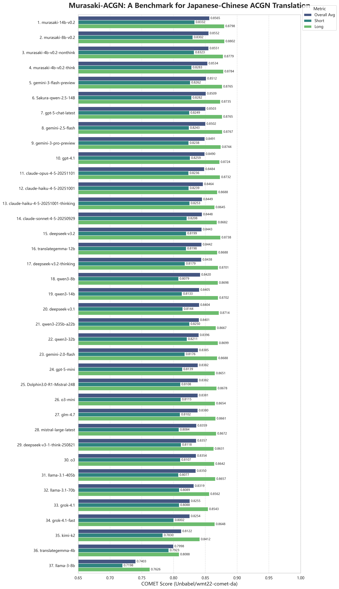
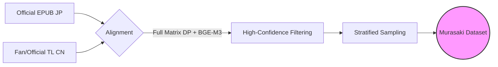

<div align="center">

<h1>Murasaki Benchmark</h1>

<p>
  <strong>A Comprehensive Benchmark for Evaluating Japanese-to-Chinese ACGN Translation Quality</strong>
</p>

<p>
  <a href="https://github.com/your-repo/murasaki-benchmark/blob/main/LICENSE">
    
  </a>
  
  
  
</p>

<p>
  <a href="#-leaderboard">📊 Leaderboard</a> •
  <a href="#-methodology">🛠️ Methodology</a> •
  <a href="#-quick-start">🚀 Quick Start</a> •
  <a href="#-citation">📝 Citation</a>
</p>

<br>



</div>

<br>

> **Murasaki Benchmark** provides two paragraph-level datasets (Short/Long) to evaluate how well LLM translations align with professional human references in the **ACGN domain**. Using XCOMET metric, we measure the semantic similarity between machine translations and authoritative reference translations at the paragraph level.

---

## Leaderboard

We evaluated **SOTA commercial and mainstream open-source LLMs** using the XCOMET metric.

| Rank | Model | Short | Long | Avg |
|:----:|:------|:-----:|:----:|:---:|
| 🥇 | **Gemini 3 Flash Preview** | 0.826 | 0.876 | **0.851** |
| 🥈 | **Sakura-Qwen-2.5-14B** | 0.828 | 0.874 | **0.851** |
| 🥉 | **GPT-5-chat-latest** | 0.825 | 0.876 | **0.850** |
| 4 | Gemini 3 Pro Preview | 0.824 | 0.874 | 0.849 |
| 5 | GPT-4.1 | 0.826 | 0.872 | 0.849 |
| 6 | Claude Opus 4.5 | 0.824 | 0.873 | 0.848 |
| 7 | Gemini 2.5 Flash | 0.824 | 0.873 | 0.848 |
| 8 | Claude Haiku 4.5 | 0.824 | 0.870 | 0.847 |
| 9 | Claude Haiku 4.5 Thinking | 0.825 | 0.866 | 0.845 |
| 10 | DeepSeek V3.2 Thinking | 0.818 | 0.870 | 0.844 |
| 11 | TranslateGemma 12B | 0.819 | 0.868 | 0.843 |
| 12 | Claude Sonnet 4.5 | 0.815 | 0.868 | 0.841 |
| 13 | o3-mini | 0.810 | 0.865 | 0.838 |
| 14 | GLM-4.7 | 0.811 | 0.865 | 0.838 |
| 15 | GPT-5-mini | 0.812 | 0.861 | 0.836 |
| 16 | o3 | 0.811 | 0.863 | 0.835 |
| 17 | Qwen3-14B | 0.810 | 0.857 | 0.833 |
| 18 | Llama-3.1-70B | 0.809 | 0.852 | 0.831 |
| 19 | Dolphin3.0-R1-Mistral-24B | 0.804 | 0.850 | 0.827 |
| 20 | DeepSeek V3.1 Think | 0.808 | 0.839 | 0.823 |
| 21 | Mistral Large | 0.802 | 0.845 | 0.823 |
| 22 | DeepSeek V3.2 | 0.810 | 0.833 | 0.821 |
| 23 | Llama-3.1-405B | 0.796 | 0.838 | 0.817 |
| 24 | Gemini 2.0 Flash | 0.813 | 0.818 | 0.816 |
| 25 | Kimi-K2 | 0.777 | 0.841 | 0.809 |
| 26 | Qwen3-235B-A22B | 0.813 | 0.786 | 0.800 |
| 27 | Qwen3-32B | 0.810 | 0.788 | 0.799 |
| 28 | DeepSeek V3.1 | 0.773 | 0.799 | 0.786 |
| 29 | Grok-4.1-fast | 0.761 | 0.785 | 0.773 |
| 30 | TranslateGemma 4B | 0.791 | 0.743 | 0.767 |
| 31 | Grok-4.1 | 0.763 | 0.771 | 0.767 |
| 32 | Llama-3-8B | 0.719 | 0.756 | 0.737 |
| 33 | Qwen3-8B | 0.714 | 0.752 | 0.733 |

Full results: [results/final_comet_scores.jsonl](results/final_comet_scores.jsonl)

---

## Key Features

* **Paragraph-Level Evaluation** — Two datasets (Short: 180-200 chars, Long: 780-800 chars) for comprehensive paragraph translation assessment.
* **Authoritative References** — Human translations from established fan groups and official Traditional Chinese releases.
* **XCOMET-Based Scoring** — Measures semantic alignment between LLM output and reference translations using neural evaluation.
* **Fair Comparison** — Standardized `temperature=1.0` and unified prompts ensure reproducible, comparable results.

---

## 🛠️ Methodology

### Data Pipeline



### Dataset Composition

| Category | Samples | Length (chars) | Content Type |
|----------|:-------:|:--------------:|--------------|
| **Short** | 100 | 180-200 | Dialogues, witty retorts, short descriptions |
| **Long** | 100 | 780-800 | Complex world-building, emotional monologues |

Covers major genres from commercial light novels and *Syosetu* web novels:

<details>
<summary><strong>🔍 Click to see Genre Coverage</strong></summary>

| Genre | Representative Works |
|-------|----------------------|
| **Isekai** | *Mushoku Tensei*, *TenSura*, *Shield Hero* |
| **RomCom** | *My Teen Romantic Comedy SNAFU*, *Oreimo*, *Kaguya-sama* |
| **Fantasy** | *SAO*, *KonoSuba*, *Spice and Wolf* |
| **Sci-Fi** | *86*, *Full Metal Panic* |
| **Slice of Life** | *Angel Next Door*, *Gimai Seikatsu* |
| **Mystery** | *Hyouka*, *Monogatari Series* |
| **War/Political** | *Youjo Senki*, *Legend of the Galactic Heroes* |

</details>

### Evaluation Protocol

| Parameter | Value |
|-----------|-------|
| Temperature | 1.0 |
| System Prompt | Standardized ([pipeline/config.py](pipeline/config.py)) |
| Special Cases | Sakura models use official recommended settings |
| Metric | COMET (Unbabel/XCOMET-XL) |

---

## 🚀 Quick Start

### Installation

```bash
git clone https://github.com/soundstarrain/murasaki-benchmark
cd murasaki-benchmark
pip install -r requirements.txt
```

### Run Evaluation

**Option 1: Local Model (e.g., Qwen via Ollama)**
```bash
ollama pull qwen2.5:14b
python examples/local_llm_demo.py
```

**Option 2: API Provider**
```bash
cp .env.example .env
# Edit .env with your API credentials
python examples/api_eval_demo.py
```

> For detailed configuration, refer to [docs/local_deployment.md](docs/local_deployment.md).

---

## 📂 Project Structure

```text
murasaki-benchmark/
├── 📂 data/           # Benchmark datasets (Short/Long splits)
├── 📂 pipeline/       # Core evaluation logic (Prompting, Scoring)
├── 📂 examples/       # Minimal runnable scripts
├── 📂 results/        # Full evaluation logs & charts
└── 📂 docs/           # Detailed documentation
```

---

## 📝 Citation

If you find this benchmark useful, please cite our work:

```bibtex
@misc{murasaki2026,
  title={Murasaki Benchmark: An ACGN Translation Benchmark for LLMs},
  author={Murasaki Team},
  year={2026},
  url={https://github.com/soundstarrain/murasaki-benchmark}
}
```

---

## 📄 License

This project is licensed under the [GPL-3.0 License](LICENSE).

> The dataset is intended for **research purposes only**. Copyrights of the original novels and translations belong to their respective owners.
